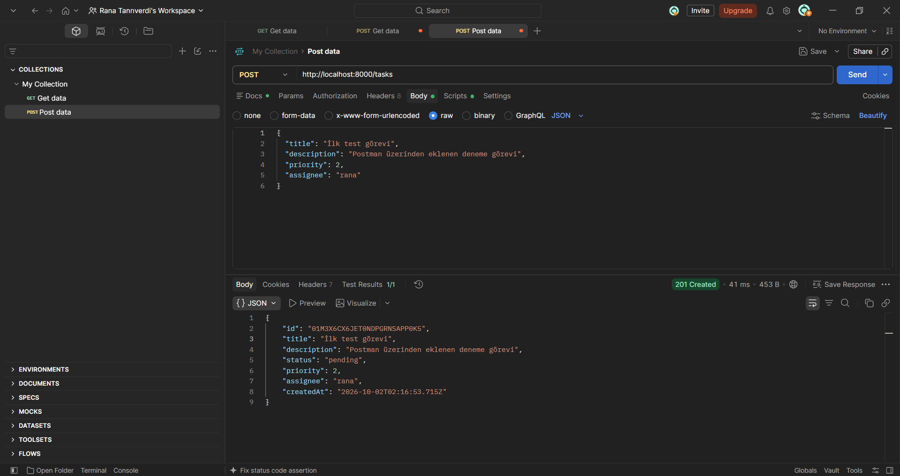
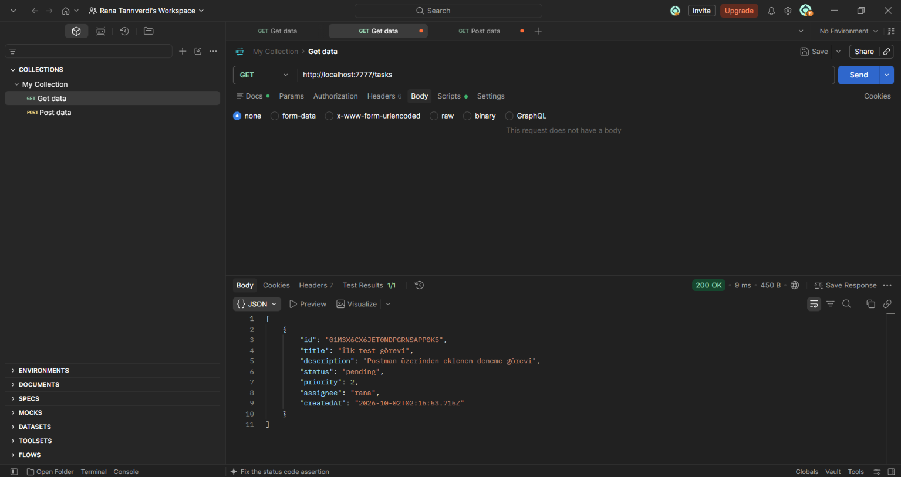
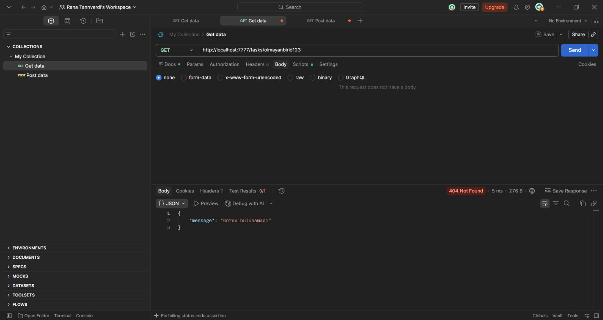
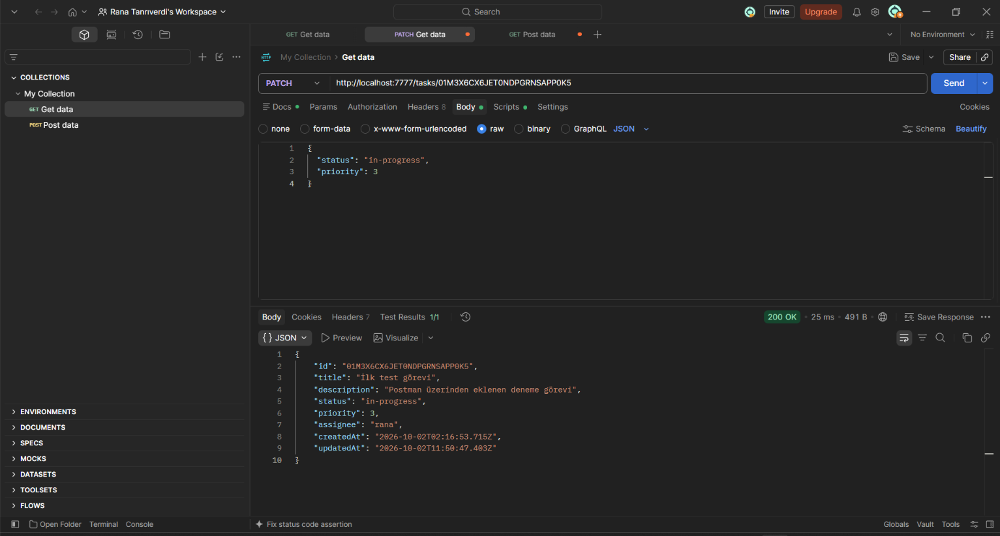
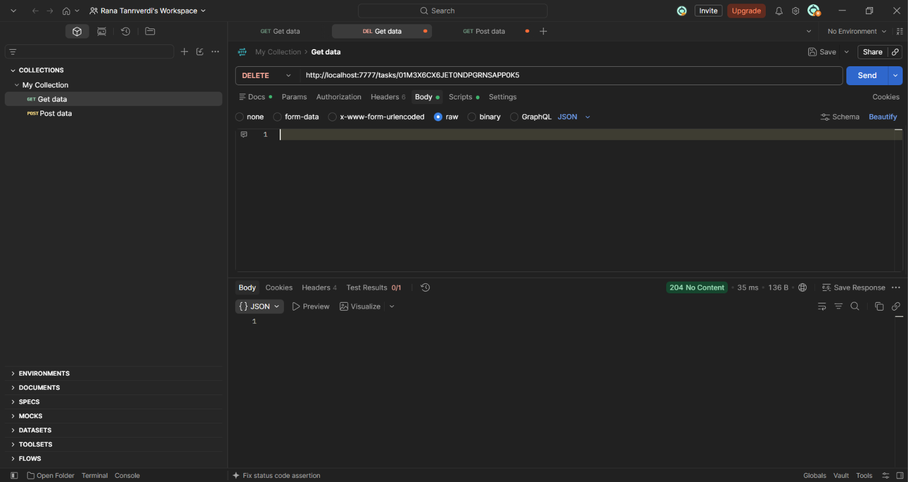

TaskFlow — Görev ve Proje Yönetim Sistemi API

Node.js ve Express.js ile geliştirilmiş, REST API mantığında çalışan bir görev yönetim sistemi backend projesi.

Gereksinimler

Node.js (npm ile birlikte gelir)

Kurulum

Depoyu bilgisayarınıza indirin/klonlayın:

   git clone https://github.com/ranatnrvrd03/taskflow-api.git

Proje klasörüne girin:

   cd taskflow-api

Bağımlılıkları yükleyin:

   npm install

Çalıştırma:

Sunucuyu başlatmak için proje klasöründeyken:

node server.js

Terminalde "Server is running on http://localhost:7777" mesajını gördüğünüzde sunucu çalışıyor demektir. API, http://localhost:7777 adresinden erişilebilir olacaktır.

API Endpoint'leri
Metod	Endpoint	Açıklama
POST	/tasks	    Yeni görev oluşturur
GET	    /tasks	    Tüm görevleri listeler
GET 	/tasks/:id	Belirli bir görevin detayını getirir
PATCH	/tasks/:id	Bir görevi kısmen günceller
DELETE	/tasks/:id	Bir görevi siler

Veri Kalıcılığı

Proje, harici bir veritabanı kullanmaz; veriler data/tasks.json dosyasında saklanır.

Test

Tüm endpoint'ler Postman kullanılarak test edilmiştir.

Test Ekran Görüntüleri

POST /tasks - Yeni görev oluşturma (201 Created)

GET /tasks - Tüm görevleri listeleme (200 OK)

GET /tasks/:id - Olmayan bir görev ID'si ile sorgulama (404 Not Found)

PATCH /tasks/:id - Bir görevi güncelleme (200 OK)

DELETE /tasks/:id - Bir görevi silme (204 No Content)

